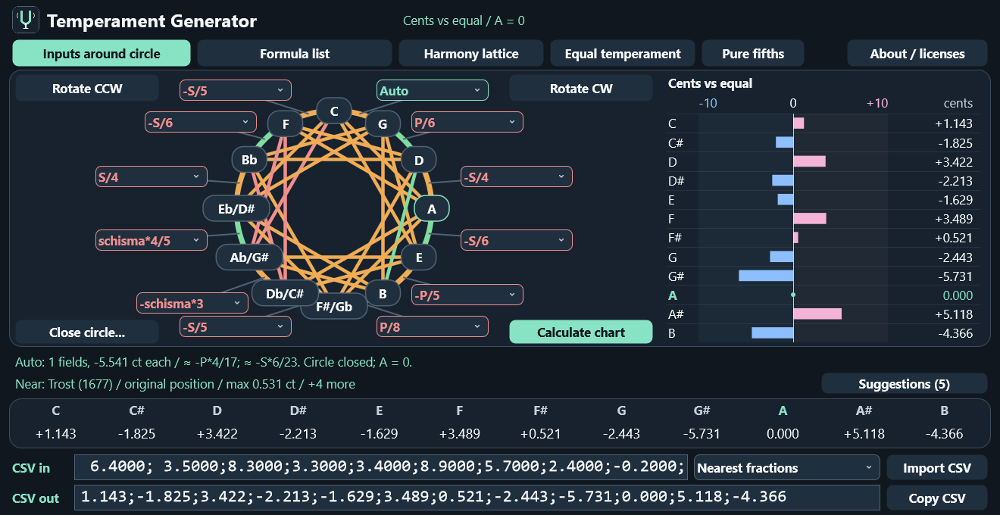
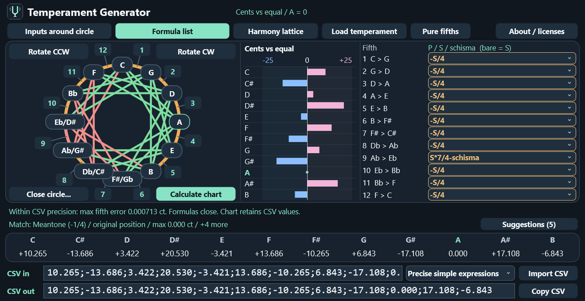
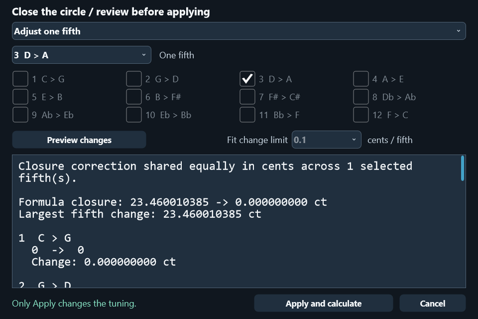
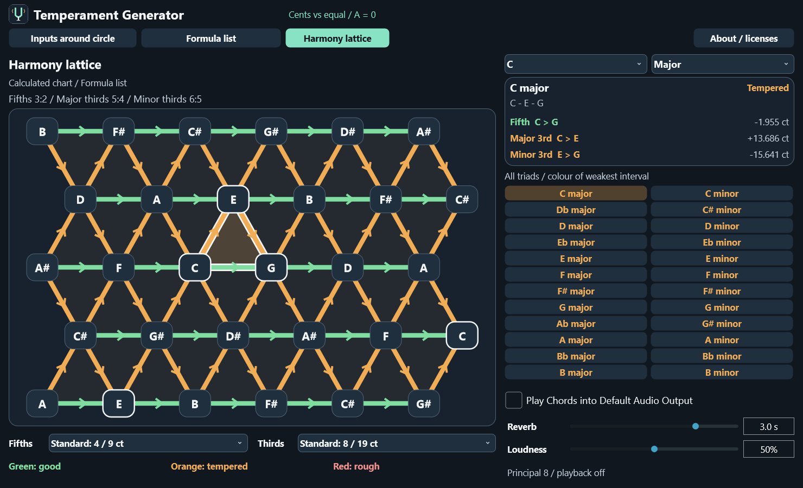
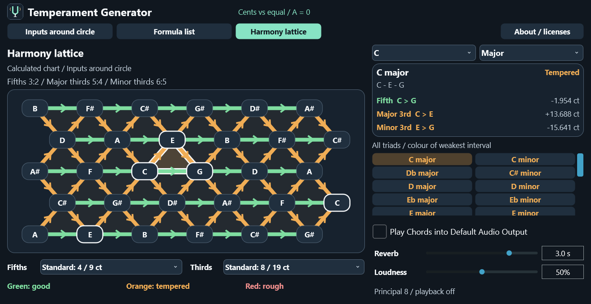

# Temperament Generator — User Manual

Temperament Generator is a visual tool for designing twelve-note temperaments,
converting comma corrections into cent charts, and inspecting how fifths and
thirds combine in chords. It is intended for people who want to experiment with
temperaments by ear and by eye: a formula tells you how a fifth was made, while
the chart tells you where the notes ended up.

The Harmony lattice can play Principal 8 chords in your current temperament,
with optional church-style reverb. The word “good” in the colour system means “close to the
chosen pure ratio”; it is a useful visual guide, not a claim about every
instrument, register, voicing, or listener.

## The main window

The two editing buttons select two views of the same temperament:

- **Inputs around circle** puts compact formula boxes around the fifth circle.
  This is the quickest view for seeing which correction belongs to which fifth.
- **Formula list** puts the circle on the left, a cent-deviation chart in the
  middle, and wide formula fields on the right. This is easier when formulas are
  long or contain several comma terms.

Changing the view does not create a second tuning. Both views are synchronised.
An expression entered in one view is converted to an equivalent physical comma
amount in the other view. The formulas may be written differently because the
two views use different default units, but they describe the same fifth.



*The compact layout: the circle, controls in its four corners, and the chart on
the right. The CSV fields remain below the result table.*



*The formula-list layout: the chart sits between the circle and the long formula
fields. This example is the quarter-comma meantone reconstruction.*

At the top are the editing buttons, **Harmony lattice**, the two presets, and
**About / licenses**. The four buttons nearest the circle have a direct effect
on the current formulas:

- **Rotate CCW** moves every fifth correction one step counter-clockwise.
- **Rotate CW** moves every fifth correction one step clockwise.
- **Close circle...** opens a review window with several ways to distribute the
  correction needed to close the twelve fifths.
- **Calculate chart** evaluates the current formulas and produces the cent chart.

The bar at the bottom of the circle reports calculation status. The next line
reports a catalogue suggestion when the result is close to a known temperament.
The row headed **C, C#, D, ... B** is the numerical result in cents. It is
always A-relative, so A is displayed as `0.000`.

## The fifth circle

The circle is read clockwise as twelve ascending perfect fifths:

```text
C → G → D → A → E → B → F#/Gb → C#/Db → G#/Ab → D#/Eb → Bb → F → C
```

C is at the top and F#/Gb is at the bottom. The left-hand branch is the same
cycle read as descending fifths, or ascending fourths.

There is one correction field for each clockwise fifth. The first field belongs
to C–G, the second to G–D, and so on. A correction is added to a pure 3:2 fifth:

```text
actual fifth = pure fifth + formula correction
```

A positive correction makes the fifth wider. A negative correction makes it
narrower. A zero correction leaves it pure. The circle must close after all
twelve corrections have been applied. In physical cents their total must equal
the negative Pythagorean comma, because twelve fifths must agree with seven
octaves.

Click a note to highlight all of its connected fifths and thirds. Click the
same note again, or click outside the circle, to remove the highlight. Clicking
a compact box or a numbered marker opens that formula for editing.

The note names intentionally show useful enharmonic alternatives, for example
`Db/C#`, `Eb/D#`, and `Ab/G#`. The harmony lattice chooses a context-specific
spelling for a selected chord.

## Reading the cent-deviation chart

The **Cents vs equal** chart is in chromatic order, from C through B. It compares
each note with twelve-tone equal temperament after normalising A to zero.

- Blue bars extend left: the note is flat relative to equal temperament.
- Pink bars extend right: the note is sharp relative to equal temperament.
- The vertical centre line is zero.
- A is always on that centre line.
- The scale is symmetric around zero and adapts to the largest deviation in the
  current chart.

The wider chart in Inputs around circle shows the numerical value beside every
bar. In the narrower Formula list chart, hover over a row for the signed value. Values are shown to three
decimal places, matching the CSV output. The internal calculation keeps more
precision than the display.

This chart is often the easiest way to understand a temperament. Formulae such
as `-S/4-schisma/4` are exact and useful for tuning, but the cent chart answers
the immediate musical question: which notes are high, which are low, and by how
much?

## Entering comma expressions

Formula boxes accept numbers, fractions, arithmetic operators, parentheses, and
the named comma units. Multiplication must be explicit. These are all valid:

```text
1-1/11
-(1-1/11)/2
-P/4
S*3/4
-S/4-schisma/4
P*3/5
ET
```

The generated notation places the comma name first, for example `P*3/5` and
`schisma*2/3`. The parser also accepts `3*P/5` and other equivalent input forms.

| Symbol or form | Meaning |
| --- | --- |
| `P` or `pythagorean` | One Pythagorean (ditonic) comma |
| `S` or `syntonic` | One syntonic (diatonic) comma |
| `schisma` or `H` | `P - S`, about 1.953721 cents |
| `ET` | The correction from a pure fifth to a 700-cent equal-tempered fifth |
| `1-1/11` | Ten elevenths of the field’s default comma |
| `-S/4-schisma/4` | Exactly `-P/4` physically |
| `P*3/5` | Three fifths of a Pythagorean comma |

Named units always retain their physical meaning. A bare number or bare fraction
uses the layout’s native unit: the compact circle uses Pythagorean units, while
the formula-list view uses syntonic units. When the expression crosses to the
other view, the program converts its physical size rather than silently changing
the interval.

The old `H` spelling is accepted for compatibility, but generated expressions
use **schisma**. The note B is called B in the English interface even though H
is used as a schisma alias.

The combo menus contain common fractions with denominators 1, 2, 3, 4, 5, 6,
12, and 24, including positive and negative values. You can type any valid
expression into an editable box; the menu is only a shortcut.

## Calculating a chart

1. Choose a layout.
2. Enter or select all twelve fifth corrections.
3. If there are no Auto fields, make sure the circle closes, or use **Close
   circle...** first.
4. Click **Calculate chart**.

If the formulas are valid and close, the result table and CSV out row update.
The A column is normalised to `0.000`. The circle arcs, third connections, cent
chart, harmony lattice, and catalogue suggestion all use the same current chart.

If a formula is invalid or the circle does not close, the program reports the
problem and leaves the input fields available for correction. Existing output is
not presented as a new valid calculation. The **CSV in** field is never cleared
or rewritten by this process; it remains the user’s reference text.

### Equal temperament and pure fifths

**Equal temperament** fills the fifths with the equal-tempered correction,
normally shown as `-P/12` in the formula list and `-1/12` in the compact view.
It closes exactly.

**Pure fifths** sets every correction to zero. This deliberately leaves an open
circle, because twelve pure fifths do not return to the same seven-octave pitch.
Use it to inspect the pure fifth geometry, then use **Close circle...** if you
want to distribute the accumulated comma.

## Automatic calculation fields

Choose **Automatic calculation** at the top of a combo menu or type `Auto`.
When you calculate, the program gives every Auto field the same physical cent
correction. Fixed fields are left unchanged:

```text
Auto correction = (-P - sum of fixed corrections) / number of Auto fields
```

This is useful when you know most of a temperament but want the remaining comma
shared between selected fifths. The Auto box is coloured green and remains Auto,
so later edits can recalculate it.

The status line and Auto tooltip show the exact cent value and nearby simple
fractions of S and P, ordered by closeness. The displayed fraction is an aid to
reading; calculation uses the full-precision cent value.

## Closing an open circle

Click **Close circle...** to open the review window. Select a method and click
**Preview changes**. Nothing changes in the main window until **Apply and
calculate** is pressed.



The available methods are:

- **Adjust one fifth**: choose the single fifth that receives the full residual.
- **Share equally across selected fifths**: tick the fifths that may change.
- **Share equally across all twelve fifths**: distribute the residual uniformly.
- **Prefer simple fractions (inference)**: choose eligible fifths and a maximum
  change per fifth. The program favours small, readable expressions, preserves
  already simple values where possible, and puts a more complicated remainder
  into an exceptional fifth when that is the clearest solution.
- **Resolve automatic fields**: adjust only the fields currently marked Auto.

The preview lists every old and new expression, the change in cents, the largest
change, and the closure result. If no solution satisfies the selected limit, the
preview says so; increase the limit, select more fifths, or choose equal
adjustment. A preview can be cancelled without changing any formula.

When a CSV chart has been imported, the inference method uses the imported
fifth corrections as its target, including their unrounded internal values. The
original CSV text remains in CSV in, and the imported note chart remains the
reference until you apply a new calculation.

## CSV input and output

The CSV fields use one semicolon-separated row in this exact chromatic order:

```text
C;C#;D;D#;E;F;F#;G;G#;A;A#;B
```

Paste twelve numeric cent deviations into **CSV in**, choose a reconstruction
method, and click **Import CSV** or press Enter. A nonzero A value is subtracted
from all twelve input values for the working chart, but the CSV in text itself
stays exactly as pasted, including spaces, extra decimal places, and its original
A value.

**CSV out** is the current calculated or imported A-normalised chart, rounded to
three decimals. It is intended for copying into another file. Use **Copy CSV**
to place it on the clipboard. When the formula calculation is invalid, CSV out
is cleared; CSV in remains available for comparison and correction.

### Nearest fractions

This mode independently chooses the nearest readable menu fraction in physical
cents. It considers P, S, schisma, ±1/24, and small multiples such as `P*2/6`
or `S*3/4`, reducing them when the result is simpler. It is fast and predictable.

### Precise simple expressions

This mode searches combinations of small P, S, and schisma terms. Three-decimal
CSV values have a half-unit uncertainty of 0.0005 cents per note, so a fifth
difference can carry approximately 0.001 cents of uncertainty. Once a readable
expression is within that range, simplicity is preferred over meaningless extra
digits.

For the catalogue’s quarter-comma meantone example, the result is eleven
`-S/4` fields and the exceptional wolf `S*7/4-schisma`. That is the kind of
result the program is designed to expose: many simple, intentional values and
one understandable remainder.

## Rotation

**Rotate CW** moves the correction on C–G to G–D, the correction on G–D to D–A,
and so on. **Rotate CCW** performs the reverse move. Auto fields and imported
rounding metadata move with the formulas.

For an imported chart, the note deviations are rotated without another fraction
rounding step. For a formula-driven chart, the formulas are recalculated. In both
cases the displayed chart is renormalised so A remains zero. Twelve steps return
to the original arrangement.

The catalogue recogniser tests all twelve fifth rotations, so a known temperament
can still be named after it has been moved around the circle.

## Catalogue suggestions

The supplied `Source/temperaments.csv` is embedded into the executable. You do
not need to keep a separate catalogue file beside the program. After import or
calculation, the program compares the A-normalised chart with every catalogue
entry and its distinct fifth rotations.

- A maximum note difference up to 0.001 cents is labelled **Match**, allowing
  for CSV rounding rather than claiming mathematical identity.
- A difference up to 1 cent is shown as a near match.
- The suggestion names the temperament, gives its rotation in fifths, and shows
  the maximum difference.
- **Suggestions** opens a scrollable large-text list. Every close name and
  distinct rotation comes first. Harmonic alternatives bring the list to at
  least five distinct names, using each alternative's best rotation.
- **Compare** means a resemblance to explore, even beyond the 1-cent limit.
  Read the reported differences: the nearest available examples can be distant.

The alternative ranking compares the complete pattern of fifths, major thirds
and minor thirds. It gives fifths half the weight, and each third family a
quarter. Lower **harmonic distance** means closer intervals in cents; this is
not a percentage or a probability of historical identity. It considers the
size of the differences as well as their pattern, and is independent of the
reference pitch. All twelve rotations are searched.

Each entry shows its rotation, maximum and RMS note differences from your
A-relative chart, the overall harmonic distance, separate RMS differences for
fifths and both thirds, and the catalogue comment. These interval differences
compare two temperaments; they are not purity errors or colour ratings.

For example, import
`10.26;-8.31;3.42;-2.2;-3.42;8.31;-10.26;6.84;-6.35;0;4.15;-6.84`.
The suggestions include **Ordinaire** (whose comment names D'Alembert/Rousseau),
alongside Schlick and a rotated Rameau. Ordinaire differs by as much as 6.35 cents
at one note but has a fifth RMS difference of only about 1.87 cents and a harmonic
distance of about 2.70 cents. It is a useful comparison, not an identical tuning.

Several names can legitimately match the same chart. Equal temperament, for
example, also appears under the catalogue’s Neidhardt Hof alias. Similar entries
are suggestions, not proof of historical identity. Trost can remain recognisable
after nearest-fraction reconstruction and one Auto field has closed the circle,
even when the rounded reconstruction introduces roughly half a cent of error.

## Harmony lattice

Click **Harmony lattice** to open the separate Tonnetz-style view. It is kept on
its own tab so the editing circle remains readable.



The lattice uses three interval families:

- horizontal arrows: ascending fifths, ratio 3:2;
- up-right arrows: major thirds, ratio 5:4;
- down-right arrows: minor thirds, ratio 6:5.

Each triangular face represents a major or minor triad. Select a root and chord
type, click a chord button, or click a triangle. The selected chord is outlined;
the detail panel lists all three interval errors in cents. Positive error means
wider than the pure ratio, negative error means narrower.

Chromatic spellings follow context where possible. A major uses C#, while Bb
minor uses Db. Enharmonic spelling changes the label only; it does not change the
tuned pitch class.

### Playing chords

At the bottom right, enable **Play Chords into Default Audio Output**. The
currently selected chord plays immediately. Then click a chord button or a
triangle in the lattice, select a note, or change the root/Major/Minor controls
to hear another chord. Clicking the same chord button again repeats it.

Each selection plays a root-position triad for **two seconds**, including a
**70 ms fade-out** at the end. A short attack prevents clicks. When changing
chords quickly, the previous notes fade out while the new chord begins.

The instrument is the supplied **Principal 8** organ stop. Its 25 recordings
cover MIDI notes 48–72 and were supplied in equal temperament at A = 440 Hz.
The app repitches each note continuously by its current cent deviation: positive
values sharpen it, negative values flatten it, and A retains its reference pitch.
The root is placed in MIDI 48–59; the third and fifth sit above it. Enharmonic
spellings do not change the sound.

Playback follows the **current chart**. Immediately after CSV import, it uses
the imported A-normalised values, even if rounded formulas do not close yet.
After a successful calculation, it uses the calculated tuning. Editing or
invalidating a chart stops the previous audition; select a chord again after
calculating. Leaving the lattice stops its audition. Unchecking playback closes
the audio device. Colour-sensitivity controls change the display, not the tuning.

**Loudness** ranges from **0 to 100%**, starting at **50%**. It adjusts both the
direct chord and its reverb tail. Zero mutes the playback; changes are smoothed
to avoid clicks. Drag the slider or type a percentage in its value box.

**Reverb** starts at **3.0 seconds** and ranges from **0.0 to 4.0 seconds**;
you can drag the slider or type
the time. Zero gives the direct, dry organ sound. Higher settings lengthen the
approximate decay of the room, and a soft tail continues after the two-second
chord ends. Only the reverb is filtered below **200 Hz** and above **2,500 Hz**,
giving a darker, church-like ambience. The direct sound keeps its original
frequency content. Use dry playback when listening closely to beating; add
reverb to hear how the chords blend in a room.

The checkbox starts off. Audio goes to the operating system's default output;
set its destination and volume in your system settings. If you change the default
device while the app is running, uncheck and recheck playback to reopen it. The
application never opens audio inputs, records sound, or asks for a microphone.
The recordings are embedded as lossless FLAC; no separate sample directory,
codec installation, or network connection is needed.

On a small screen the chord-button list scrolls, keeping the audio checkbox and
sliders visible. The lattice and root/type selectors remain available as well.

### Purity colours and sensitivity

Green means close to pure, orange means tempered, and red means rough according
to the selected limits. Fifths and thirds have independent controls because the
ear is usually less forgiving of fifth errors in a fifth-based texture than of
moderate third adjustments.

| Interval | Sensitivity | Green | Orange | Red |
| --- | --- | --- | --- | --- |
| Fifths | Strict | up to 2 ct | 2–6 ct | above 6 ct |
| Fifths | Standard | up to 4 ct | 4–9 ct | above 9 ct |
| Major/minor thirds | Strict | up to 5 ct | 5–15 ct | above 15 ct |
| Major/minor thirds | Standard | up to 8 ct | 8–19 ct | above 19 ct |

The boundaries are inclusive at the green and orange limits. That is why
`-schisma` and equal temperament’s `-P/12`, which are both about 1.95 cents from
a pure fifth, have the same green colour at both fifth sensitivities. A third
21 cents sharp or flat is red even at Standard sensitivity.

The circle uses the same colour limits as the lattice. Thick highlighted lines
show the selected tone’s connected fifths and thirds. A chord is coloured by its
worst interval, so one red fifth can make an otherwise attractive chord red.



*The same interval analysis is visible in the lattice: green is close to the
pure ratio, orange is intermediate, and red is furthest away under the selected
sensitivity.*

## Understanding the program’s musical model

The program starts from a pure 3:2 fifth and records a correction for each
clockwise fifth. Twelve pure fifths do not equal seven octaves; their mismatch is
the Pythagorean comma:

```text
P = 1200 log2(531441 / 524288) ≈ 23.460010385 cents
S = 1200 log2(81 / 80)        ≈ 21.506289597 cents
schisma = P - S                ≈  1.953720788 cents
```

The basic design question is therefore: where should the unavoidable comma go,
and how should the syntonic comma be distributed so that thirds are useful?

The program keeps the symbolic expression and the physical cent value together.
That is deliberate. A formula such as `-S/4` communicates a tuning decision;
`-5.376572649` cents does not. The cent chart then translates the symbolic
decision into the actual note positions that a musician sees.

There is no single “best” temperament. Equal temperament makes every key equally
usable. Meantone makes selected major thirds especially pure and accepts a wolf
fifth. Historical well temperaments distribute the comma unevenly to give keys
different characters. The tool lets you inspect those trade-offs without hiding
the arithmetic behind a single score.

## Troubleshooting

**“The intervals do not close.”**  The twelve corrections do not sum to the
required physical `-P`. Click **Close circle...**, use Auto fields, or adjust the
limit and eligible fifths. The program will not silently change an unselected
field.

**A box is red.** After CSV import, red formula text indicates a reconstruction
difference above 0.001 cents; amber indicates a smaller rounding difference.
Hover for the signed difference. A red error can also indicate an invalid
expression: read the status, check parentheses, use explicit multiplication,
and remember that division by zero is rejected.

**No sound.** First calculate or import a valid chart, enable playback, and
select a chord. Check your system's default output and volume. If the status
reports **Audio unavailable** or a disconnected output, hover over it for details,
restore the device, then uncheck/recheck playback. The visual calculator works
without an audio device. On Linux, ALSA must be able to reach your desktop's
default sound output.

**The chart disappeared after editing.**  Editing a formula makes the previous
calculation stale, so the cent bars and harmony colours are removed until you
calculate again. CSV in is intentionally preserved.

**CSV out does not resemble CSV in.**  CSV in is your original reference row;
CSV out is the A-normalised result of the current formulas. Compare the two rows
to see the effect of fraction rounding, closure, or a chosen rotation.

**The catalogue only offers Compare results.** No entry is within the 1-cent
near-match limit. Open **Suggestions** to compare the closest interval patterns,
their rotations and their actual differences. A historical variant may resemble
several entries; the catalogue cannot establish its identity from numbers alone.

**The chart is too large for the monitor.**  The application keeps large fonts
and uses a scrollable content area for smaller windows. A 1320×660 content area
is covered by the built-in layout checks; maximising the window gives the charts
more space.

## Files, licensing, and reproducibility

The application is free and open source under the GNU Affero General Public
License v3. The **About / licenses** window contains the full license and
third-party notices offline. The embedded catalogue is compiled into the program,
so results do not depend on a runtime network connection or a separate CSV file.

For a precise experiment, record the version, layout, formulas, sensitivity
settings, and the original CSV in row. CSV out records the displayed chart, but
the formula fields preserve the more meaningful symbolic explanation of how that
chart was made.
